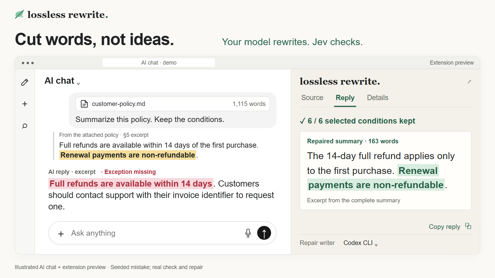
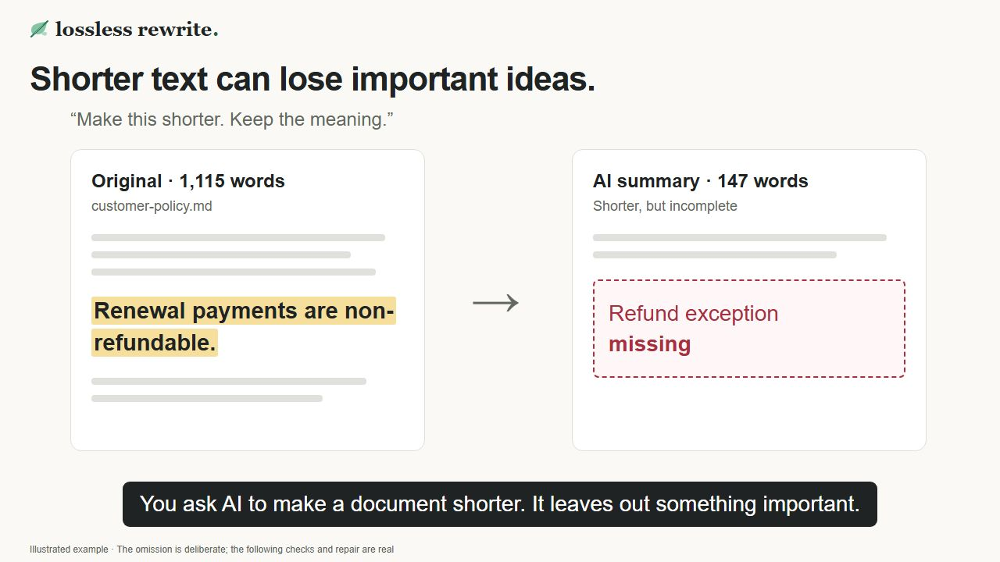

# Lossless Rewrite

### Cut words, not ideas.

Ever asked AI to shorten a report, then had to add the important bits back?

Choose what must stay. **Your model rewrites, and Jev checks for missing ideas and helps repair them.**

Use the local editor, command line, or experimental browser extension.

[](public/demo/social.mp4)

[Explore the saved demo](https://dttfrancesco.github.io/lossless-rewrite/) · [Watch the video](#watch-the-demo) · [Install](#install)

## A few uses

- 📄 **Papers:** tighten the writing while preserving results and caveats.
- 📋 **Policies:** simplify the text while keeping conditions, exceptions and deadlines.
- ✉️ **Emails:** change the tone while keeping the message and commitments.

## How it works

1. **Select what must stay:** exact wording, the same meaning, or key ideas extracted from a section.
2. **Rewrite the document:** ask your model to summarize, shorten or change the tone.
3. **Check the result:** see which selected details survived, inspect failures, and request a repair.

The result is a rewrite of the whole document, with your selected details checked.

## What you can do

- **Keep wording:** check that a quote or approved sentence stays exactly as written.
- **Keep meaning:** allow paraphrasing while checking facts, conditions and uncertainty.
- **Must cover:** extract a section’s key ideas into a checklist you review before rewriting.
- **Rewrite and compress:** change tone or structure, summarize, or request a word count or percentage reduction.
- **Check an existing draft:** compare it with the source through the CLI or extension, without generating a new version.
- **Repair and revise:** restore missing details, give follow-up style feedback, and check again.
- **Trace each check:** see matching source/output passages and explanations; inspect attempt history and export evidence through the extension.
- **Import or exclude:** open `.txt`/`.md`; import selectable-text PDFs or omit source passages in the editor.

[Editor guide](docs/EDITOR.md) · [CLI guide](docs/CLI.md) · [Extension](extension/README.md) · [Use the TypeScript engine](docs/ENGINE.md)

Combine protections on overlapping passages. Undo and redo changes in the editor.

## Watch the demo

<a href="public/demo/social.mp4"></a>

[▶ Watch the 48-second walkthrough](public/demo/social.mp4) · [Caption file](public/demo/captions.vtt)

Male narration and on-screen captions. Shows meaning checks, exact wording, key-idea coverage, existing-draft checks and style changes.

### The example, explained

A **1,115-word customer policy** says that first purchases can be refunded within 14 days, but renewals cannot. A summary drops the renewal exception. Lossless flags the change and restores it in a **163-word summary, with all six selected checks passing**.

Illustrated chat; deliberate omission, real checks and repair.

**Example files:** [Full source document (.md)](demo/customer-policy.md) · [Instruction, selections and complete outputs](demo/document-walkthrough.md)

## What the checks mean

Only selected details are individually checked. A pass means they were judged consistent with the source, not that the source is true. Extraction and meaning checks can be wrong; unresolved results stay visible, and a rewrite may miss its length target.

[Saved demo run](demo/document-repair.json) · [Validation status](docs/REVIEW.md)

## Install

Requires **Git and Node.js 22.16+**.

```sh
git clone https://github.com/dttfrancesco/lossless-rewrite.git
cd lossless-rewrite
npm install
npm run demo
```

This terminal demo replays a saved check and repair. **No API keys, model calls or network requests during replay.**

### Live rewriting

You need a **Jev API key** for meaning checks and **one connected model** for rewriting.

1. Copy [`.env.example`](.env.example) to `.env.local`.
2. Add your [Jev key](https://www.jevai.org/agent/keys) and configure a writer. For an already authenticated Codex CLI:

   ```dotenv
   TYPESAFE_API_KEY=your-jev-key
   LLM_PROVIDER=codex-cli
   LLM_MODEL=default
   ```

   For API keys or CLI login instructions, see [model setup](docs/MODELS.md).
3. Run `npm run dev` and open [localhost:3000](http://localhost:3000).

Supported connections: OpenAI, Anthropic, Gemini, AI Gateway, compatible endpoints, Codex CLI and Claude Code. Custom model IDs are supported. Keys remain local; live text goes to your selected model and Jev.

Prefer the terminal? Use the same setup, without a dev server:

```sh
npm run rewrite -- --file input.md --instruction "Make this clearer."
```

The CLI supports existing drafts, explicit protections, stdin and JSON reports. Without selections, it extracts key ideas. On PowerShell, use `npm.cmd`. [CLI examples](docs/CLI.md)

### Browser extension

An **experimental sidebar for ChatGPT and Claude** provides the same protection modes, checks and API/CLI repairs. It can also prepare a follow-up for you to send in the chat; it never sends messages automatically.

Requires an unpacked extension and a local companion. Live-site behavior has not yet been manually validated. [Install the extension](extension/README.md)

## Contribute

Found a missed detail, false alarm or awkward repair? Share a small synthetic or redacted example. [Contribution guide](CONTRIBUTING.md) · [MIT license](LICENSE)
